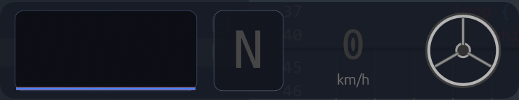

# Racing Pedal Overlay

A transparent, borderless, always-on-top HUD for sim racing built with Rust.  
Displays real-time pedal inputs (throttle / brake / clutch), gear, speed, and steering position.



## Features

- **Scrolling pedal graph** — configurable rolling trace (2–30s, default 8s): green (throttle), red (brake), blue (clutch)
- **ABS detection** — brake line turns orange when ABS is active (Assetto Corsa Evo via shared memory)
- **TC detection** — throttle line turns yellow when traction control intervenes; thin purple line shows game-applied throttle
- **Gear indicator** — color shifts green → yellow → red based on engine RPM
- **Speed readout** — km/h from sim telemetry
- **Steering wheel** — miniature rotating wheel icon from hardware axis or game telemetry
- **Hardware input** — reads pedals and wheel via [`gilrs`](https://crates.io/crates/gilrs) (HID/DirectInput)
- **Fully resizable** — all widgets scale proportionally; resize grip appears on hover (bottom-right corner)
- **Borderless & transparent** — rounded-corner overlay with drag-to-move
- **Debug mode** — press `D` to see raw axis codes, SHM probe data, pedal inversion toggles, widget visibility toggles, and telemetry diagnostics

## Sim Support

**Assetto Corsa Evo** — reads shared memory directly via Win32 FFI (`acevo_pmf_physics`). Supports AC Evo 0.6+ and falls back to classic `acpmf_physics` name.

## Hardware

Developed and tested with:

- **Moza R3** direct-drive wheel
- **Moza SRP Lite** pedals (2-pedal set)

Other HID gamepads / wheels should work — use the debug overlay (`D`) to identify axis codes and toggle pedal inversion if your pedals read backwards.

## Controls

| Input             | Action                                |
|-------------------|---------------------------------------|
| `D`               | Toggle debug overlay                  |
| `[` / `]`         | Shrink / grow graph time window       |
| `Arrow Up / Down` | Simulate throttle / brake (keyboard)  |
| `Space`           | Simulate clutch (keyboard)            |
| `Arrow L / R`     | Simulate steering (keyboard)          |
| Drag anywhere     | Move the overlay window               |
| Hover bottom-right corner | Resize grip (activates after ~500ms) |

## Building

Requires the Rust toolchain. The project pins `stable-x86_64-pc-windows-msvc` via `rust-toolchain.toml`.

```sh
cargo build --release
```

The binary lands in `target/release/racing_pedal_overlay.exe` (or `target/x86_64-pc-windows-msvc/release/` depending on your toolchain).

## Running

```sh
cargo run --release
```

Launch your sim, then start the overlay. It will auto-detect AC Evo's shared memory and begin reading telemetry. Without a sim, the gear shows "N" and speed shows "0" — pedals and steering still work from hardware or keyboard.

## Axis Mapping

Moza devices report as `RawGameController` via Windows Gaming Input, so axes may show as `Unknown`. To map your hardware:

1. Run the overlay and press `D` to open the debug overlay
2. Press each pedal one at a time and note the axis + code
3. If a pedal reads backwards (100% when released, 0% when pressed), click the corresponding **invert** button (`T inv` / `B inv` / `C inv`) in the debug panel
4. For completely different axis assignments, update the `match axis` block in `read_inputs()` in `src/input.rs`

> **Note:** Inversion settings are runtime-only and reset when the overlay is restarted. The defaults are tuned for Moza SRP Lite pedals (throttle: direct, brake: inverted, clutch: direct).

## Architecture

```
┌────────────────────────────────────────────────────────────┐
│  main thread (eframe / egui)                               │
│  ┌──────┐ ┌──────┐ ┌───────┐ ┌───────┐                   │
│  │Graph │ │ Gear │ │ Speed │ │ Wheel │  ← widgets.rs      │
│  └──────┘ └──────┘ └───────┘ └───────┘                   │
│       ▲ gilrs (input.rs)      ▲ mpsc::Receiver            │
└───────┼───────────────────────┼───────────────────────────┘
        │                       │
   USB / HID axis       ┌──────┴──────┐
   (pedals, wheel)      │  telemetry  │ ← telemetry.rs
                        │   thread    │   (std::thread + Win32 FFI)
                        └─────────────┘
```

- **Main thread** — immediate-mode GUI via `eframe`/`egui`. Polls `gilrs` events and draws custom widgets each frame.
- **Telemetry thread** — plain `std::thread`, polls AC Evo shared memory at ~60 Hz, sends snapshots over `std::sync::mpsc`.
- **AC shared memory** — reads `Local\acevo_pmf_physics` directly via Win32 FFI to get pedals, gear, speed, RPM, ABS/TC status.
- **Scaling** — every font size, stroke width, and margin is proportional to `scale = available_height / 56.0`, so the overlay looks consistent at any size.

## Source Layout

| File | Purpose |
|------|---------|
| `src/main.rs` | App state, entry point, render loop |
| `src/telemetry.rs` | AC Evo SHM FFI, telemetry thread, probe infra |
| `src/widgets.rs` | Graph, gear, speed, wheel, resize grip |
| `src/input.rs` | Gamepad/pedal input, keyboard fallback |
| `src/debug.rs` | Debug overlay panel (local-only, excluded from git) |

## Dependencies

| Crate       | Purpose                              |
|-------------|--------------------------------------|
| `eframe`    | Native GUI framework (egui backend)  |
| `egui_plot` | Scrolling line chart                 |
| `gilrs`     | Cross-platform gamepad/wheel input   |

## License

MIT
